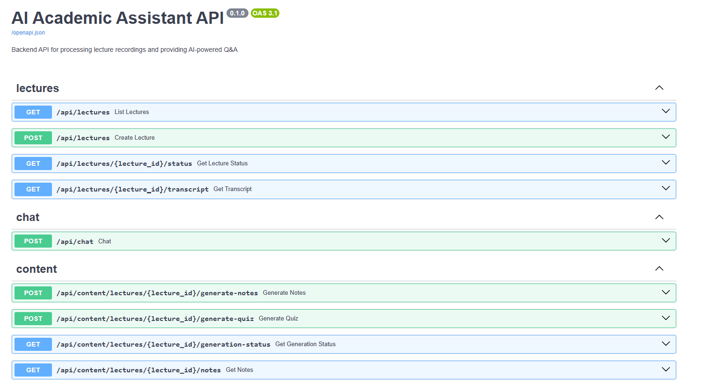
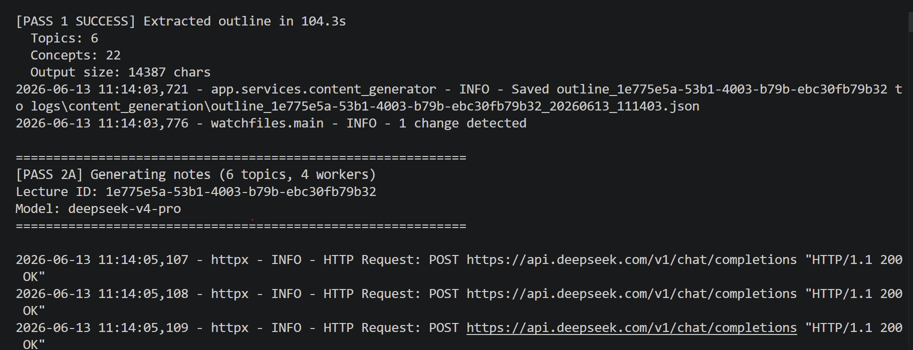

# Lecture Intelligence — Backend

> Turn a raw university lecture recording into a searchable knowledge base, German study notes, and an interactive quiz — automatically.

A production-style **FastAPI** backend that ingests lecture videos, transcribes and cleans them, embeds them for semantic search, and runs a multi-pass LLM pipeline to generate structured study materials. Built around a **RAG Q&A** engine and a cost-conscious, multi-model LLM architecture.

---

## What it does

Give it a lecture URL and it runs the full pipeline end to end:

```
URL ─▶ download audio ─▶ transcribe ─▶ LLM cleanup ─▶ chunk ─▶ embed ─▶ pgvector
                                                                          │
                                  ┌───────────────────────────────────────┘
                                  ▼
        RAG Q&A   +   Outline ─▶ Notes (DE) + Quiz   ─▶ Coverage check
                                     │
                                     └─▶ Translate notes (DE → PL / EN)
```

- **🎥 Ingestion** — pulls audio with `yt-dlp`, transcribes via Whisper (Groq/OpenAI), then an LLM removes filler/ASR noise. Every step streams **fine-grained progress** back to the client (download %, transcription chunk, cleanup block, embedding batch).
- **💬 RAG Q&A** — vector search over lecture chunks with query rewriting, scope filtering (global / course / single lecture), and answers with **timestamped source citations**.
- **📚 Study material generation** — a **3-pass pipeline** (outline → notes + quiz in parallel → coverage verification) produces German Markdown notes and a mixed-type quiz.
- **🌍 Translation** — one-click translation of notes from German to Polish or English, on the cheaper model.
- **✅ Quizzes** — multiple-choice, true/false, and open-ended questions; attempts (including learner self-grades for open-ended answers) are persisted for progress tracking.

---

## Engineering highlights

The parts that were actually hard, and what I did about them:

| Challenge | Approach |
|-----------|----------|
| **LLM output truncation** | Token-budget engineering that distinguishes *characters* from *tokens*, escalates the budget on retry, and is **language-aware** (Polish tokenizes ~1 token/char, so translation gets a bigger budget). |
| **Unparseable JSON from LLMs** | Layered recovery: direct parse → strip code fences → `json-repair` → custom brace/string balancer that reconstructs truncated objects. |
| **Long-running, opaque jobs** | Progress callbacks threaded through every service so the API surfaces a constantly-moving, human-readable status instead of a frozen spinner. |
| **Latency on large lectures** | `ThreadPoolExecutor` parallelism for transcript cleanup, per-topic note/quiz generation, and per-block translation — each call kept small enough to never hit the output cap. |
| **API cost** | **Two-model strategy** — the cheap/fast model (`deepseek-v4-flash`) for cleanup, Q&A and translation; the stronger model (`deepseek-v4-pro`) only for outline/notes/quiz synthesis. |
| **Generation quality** | A dedicated **coverage-verification pass** scores how completely the notes/quiz cover the source outline and flags gaps. |

---

## Tech stack

- **API:** FastAPI + Pydantic, background tasks for async generation
- **Database:** PostgreSQL + `pgvector` (Supabase), `vector(1536)` embeddings
- **LLM:** DeepSeek (`v4-flash` / `v4-pro`) via a thin typed client
- **Transcription:** Whisper — Groq `whisper-large-v3-turbo` (default) or OpenAI `whisper-1`
- **Embeddings:** OpenAI `text-embedding-3-small`
- **Audio:** `yt-dlp` (domain-allowlisted)
- **Config:** YAML with `${ENV_VAR}` substitution

---

## Architecture

```
backend/
├── app/
│   ├── api/
│   │   ├── lectures.py     # ingestion: submit, status, transcript
│   │   ├── chat.py         # RAG Q&A
│   │   └── content.py      # notes, quizzes, translation, attempts
│   ├── services/
│   │   ├── audio_extractor.py   # yt-dlp + MP3 extraction (+progress)
│   │   ├── transcription.py     # Whisper, 10-min chunking
│   │   ├── llm.py               # DeepSeek client + transcript cleanup
│   │   ├── embeddings.py        # batched OpenAI embeddings
│   │   ├── rag.py               # retrieval + answer synthesis
│   │   ├── content_generator.py # 3-pass generation + translation
│   │   └── database.py          # psycopg2 pool, all SQL
│   ├── models/             # Pydantic request/response schemas
│   ├── config.py           # YAML + env config loader
│   └── main.py             # app + routers + health checks
├── prompts/                # versioned LLM prompt templates
└── migrations/             # ordered SQL migrations
```

### The content-generation pipeline

```
                 Cleaned transcript
                        │
              Pass 1 ── Outline (deepseek-v4-pro)
                        │  structured topics, concepts, formulas
            ┌───────────┴───────────┐
       Pass 2a                   Pass 2b
       Notes (DE)                Quiz                  ← run in parallel,
       per-topic, parallel       per-topic, parallel     one LLM call per topic
            └───────────┬───────────┘
                     Pass 3
              Coverage verification (cheap model)
                        │
              Persisted study materials
```

---

## API overview

```http
# Ingestion
POST /api/lectures                       # submit a lecture URL
GET  /api/lectures                       # list lectures
GET  /api/lectures/{id}/status           # live processing status + progress
GET  /api/lectures/{id}/transcript       # transcript with timestamps

# Q&A
POST /api/chat                           # RAG answer with source citations

# Study materials
POST /api/content/lectures/{id}/generate-notes
POST /api/content/lectures/{id}/generate-quiz
GET  /api/content/lectures/{id}/generation-status
GET  /api/content/lectures/{id}/notes
POST /api/content/lectures/{id}/notes/translate     # DE → pl/en
GET  /api/content/lectures/{id}/notes/translation

# Quizzes & attempts
GET  /api/content/lectures/{id}/comprehensive-quiz  # latest quiz
GET  /api/content/lectures/{id}/quizzes             # all quizzes (history)
GET  /api/content/quizzes/{quiz_id}                 # one quiz (retake)
POST /api/content/quizzes/{quiz_id}/attempts        # save an attempt
GET  /api/content/quizzes/{quiz_id}/attempts        # attempt history
```

Interactive, auto-generated docs at **`/docs`** (Swagger UI).

---

## Quick start

```bash
# 1. Install
pip install -r requirements.txt

# 2. Configure — create .env with:
#    DEEPSEEK_API_KEY=...
#    OPENAI_API_KEY=...
#    GROQ_API_KEY=...
#    DATABASE_URL=postgresql://...   # Supabase Postgres
#    (model names, chunking, RAG knobs live in config.yaml)

# 3. Apply database migrations
python run_migration.py

# 4. Run
uvicorn app.main:app --reload        # http://localhost:8000
```

---

## Data model

| Table | Purpose |
|-------|---------|
| `lectures` | metadata, status, progress, raw + cleaned transcript |
| `lecture_chunks` | embedded text chunks (`vector(1536)`) for RAG |
| `lecture_outlines` | structured outline (Pass 1) |
| `lecture_notes` | German Markdown notes (Pass 2a) |
| `lecture_note_translations` | translated notes, keyed by `(lecture, language)` |
| `quizzes` / `quiz_attempts` | generated quizzes + scored attempts |
| `coverage_reports` | quality/coverage verification (Pass 3) |
| `content_generation_status` | async generation progress |

---

## Rough economics

For a ~110-minute lecture (estimates):

- Audio extraction — free (`yt-dlp`)
- Transcription — the dominant cost; **Groq Whisper** is used by default to keep it low
- Embeddings — negligible
- Full content generation — a few cents on DeepSeek
- **Q&A** — fractions of a cent per question on the flash model

The two-model split keeps the expensive model on the work that actually needs it.

---

## Screenshots



