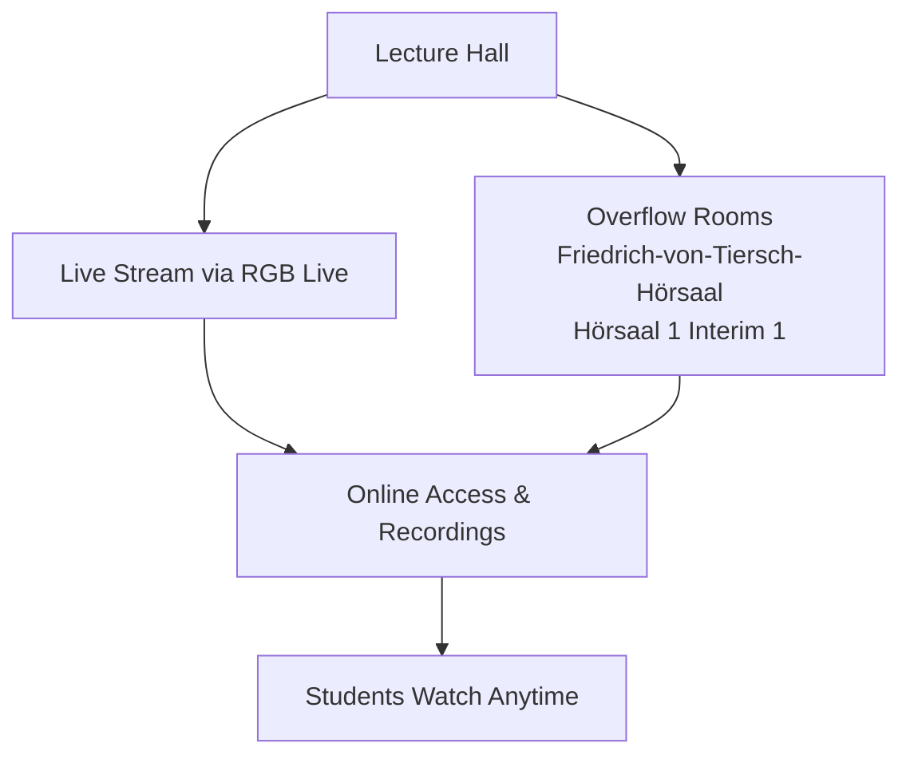

# Einführung in die Informatik (IN0001) / Grundlagenpraktikum Programmierung (IN0002)

> **Topics:** Welcome and General Introduction, Organizational Details for the Lecture (IN0001), Organizational Details for the Practical Course (PGDP, IN0002), Content Overview and Motivation

---

## Table of Contents
1. Welcome and General Introduction
2. Organizational Details for the Lecture (IN0001)
3. Organizational Details for the Practical Course (PGDP, IN0002)
4. Content Overview and Motivation

---
## Welcome and General Introduction

### Overview
This topic sets the stage for the first lecture of the course **Einführung in die Informatik** (Introduction to Computer Science). Prof. Rüdiger Westermann introduces himself, his academic background, and the organizational details of both the lecture (IN0001) and the accompanying practical course (IN0002). The core message is that these two components are separate, independently examinable modules, granting students flexibility in how they approach their studies.

### Key Concepts

#### Introduction of Lecturer
**Definition:**  
The instructor provides his identity and affiliation, establishing credibility and personal relevance to certain student groups.

**Explanation:**  
Prof. Westermann is the head of the **Chair of Computer Graphics and Visualization** (Lehrstuhl für Computergrafik und Visualisierung). He specifically mentions the relevance of his field for **Games Engineering** students, highlighting that the content of his chair aligns directly with their degree program. This introduction serves not only as a personal greeting but also as a signal to students that the material they will encounter is grounded in real‑world applications, especially in visual computing. His name is given as Rüdiger Westermann, which is typical for a formal academic setting.

> **Note:** For Games Engineering students, the Chair’s focus on computer graphics is particularly pertinent; they can expect future connections between the introductory material and advanced graphics or visualization topics.

#### Lecture and Practical Course as Separate Modules
**Definition:**  
The module **Einführung in die Informatik** (IN0001) and the practical course (Praktikum, IN0002) are independent educational units, each with its own examination. Students may choose to complete one or both without one being a strict prerequisite for the other in terms of registration.

**Explanation:**  
A common misconception in introductory courses is that the practical component is an obligatory extension of the lecture. Here, it is explicitly clarified that IN0001 (lecture) and IN0002 (practical course) are **eigenständige Module** (autonomous modules). Each has a separate **Prüfungsleistung** (examination), meaning the grading events are distinct and unrelated. Consequently, a student can be enrolled in:
- Only the lecture (IN0001),
- Only the practical course (IN0002),
- Or both simultaneously.

This modular independence gives students flexibility, but it also requires them to be aware that passing one does not automatically grant credits for the other. Registration, coursework, and exam dates must be managed separately for each module.

> **Note:** Check your specific degree program regulations (“Fachprüfungsordnung”) to see whether both modules are mandatory or only one is required. The lecturer’s statement does not override those rules.

### Key Takeaways
- The lecturer is Prof. Rüdiger Westermann, head of the Chair of Computer Graphics and Visualization, with content especially relevant for Games Engineering students.
- IN0001 (lecture) and IN0002 (practical course) are **separate, independent modules** with their own examinations.
- Students may take IN0001, IN0002, or both, depending on their study plans.
- Always verify module requirements against your specific degree regulations.

---

## Organizational Details for the Lecture (IN0001)

### Overview
Prof. Westermann covers all the logistical details necessary for participating in the course: where and when the lectures take place, how the streaming and recording setup works, what the language policies are for lectures, forums, and exams, and why it is essential to stay engaged from the very beginning. Understanding these points will help you navigate the semester without surprises.

### Key Concepts

#### Lecture Schedule and Locations
**Definition:** The lectures are held twice a week – on Mondays and Wednesdays – at the times posted in the official course catalogue.

**Explanation:** The main lecture is delivered in a central lecture hall, but because of high demand, the university provides two additional overflow rooms (Friedrich-von-Tiersch-Hörsaal and Hörsaal 1 Interim 1) where a live stream of the lecture is shown simultaneously. This way, all students can attend physically if they choose, even when the main hall is full.

> **Note:** Specific times are not mentioned in this segment; check your schedule for the exact start and end times.

#### Streaming and Recordings
**Definition:** All lectures and both central exercises are transmitted via **RGB Live** (the university’s streaming platform) and are saved as on-demand recordings.

**Explanation:** The live stream allows you to follow the lecture from anywhere with an internet connection. Recordings remain accessible afterwards, so you can review material at any time or catch up if you miss a session. There is **no mandatory attendance** – you may use the recordings exclusively if you prefer.

**Example:**
- A student unable to attend on Wednesday can watch the lecture recording later the same day or over the weekend.
- The two central exercise sessions are also streamed and recorded in the same manner.

> **Important:** During the first lecture there was a brief technical issue (the stream did not show slides). This was resolved during the session itself. If you ever experience problems, check the platform status or ask in the forum.

#### Language Policy
**Definition:** The course operates with a multilingual framework: lectures are held in German, but written communication on Moodle should be in English, and exams may be answered in either language.

**Explanation:**
- **Lectures:** The faculty requires that the spoken language of instruction be German. Prof. Westermann delivers the lecture in German.
- **Moodle Forum:** When posting questions on the `Vorlesungsmodel` (lecture moodle), students are asked to write in English. This accommodates the international teaching staff who may not be fluent in German.
- **Exams (`Prüfung`):** The language in which the exam questions are written is still to be decided. However, Prof. Westermann confirmed that **answers may definitely be written in English**. If you prefer to write in English, you can do so regardless of the question language.

> **Key point:** The instruction language for the exam questions is undecided; wait for an official announcement.

#### Continuous Participation Advice
**Definition:** The professor strongly advises staying involved with the course material from the very first week, even if you already have programming experience.

**Explanation:** The course builds on concepts sequentially. Falling behind, especially in the first two and a half months, makes it extremely difficult to catch up later. This warning is directed at students who might be tempted to skip early lectures because they think they “already know” the basics.

> “Es wird extrem schwierig, dann hinten in den letzten drei Wochen das aufzuholen, was Sie in den ersten zweieinhalb Monaten nicht mitgelernt haben.”
> *(It will be extremely difficult to make up for what you didn’t learn in the first two and a half months during the last three weeks.)*

Even if you are an experienced programmer, engage with the course’s specific approach and the theoretical foundations.

### Streaming and Lecture Access Diagram

### Additional Clarifications (from Q&A)
- **Exam language:** Questions may be in German or English; the exact language is not yet fixed. But **answers in English are always allowed**.
- **Slides availability:** Lecture slides are uploaded to Moodle **two to three days before** the lecture date.
- **Stream visibility:** The stream initially had a problem (slides not shown), but it was confirmed to be working later in the session.

### Key Takeaways
- Lectures are twice a week; two overflow rooms carry a live stream if the main room is full.
- All lectures and central exercises are streamed via **RGB Live** and stored as recordings – attendance is not mandatory.
- Speak German during lectures, but write **English** in the Moodle forum; exams can be answered in English (question language TBD).
- Start early and keep up; catching up later is almost impossible, even with prior programming knowledge.
- Slides appear on Moodle 2–3 days before each lecture.

---

## Organizational Details for the Practical Course (PGDP, IN0002)

### Overview
The practical course “Programmierpraktikum” (PGDP, IN0002) is introduced by Jan Wagner. He outlines the administrative and organisational framework for the semester: the teaching team, weekly schedule, central exercise sessions, homework structure, registration via matching, communication channels, and immediate first-week tasks. This module is graded based on continuous homework assignments, not a final exam, and strict anti-plagiarism rules apply.

### Teaching Team
The course is coordinated by **Jan Wagner** (Lehrstuhl 4, Prof. Pretschner) together with **Bechtat** (Lehrstuhl 15) and supported by **seven student assistants (Hiwis)**.

### Semester Schedule
The semester runs for **15 weeks**, with a two-week Christmas break between weeks 10 and 11. Each week includes:
- Two central exercise sessions (ZÜ1 and ZÜ2)
- One homework sheet (published Thursday, due 10 days later on Sunday at 18:00)
In the first week only ZÜ2 takes place (a special exception).

---

### Zentralübungen (Central Exercises)

#### Format
- Two distinct exercises per week: **ZÜ1** and **ZÜ2**.
- Multiple parallel time slots are offered so that all students can attend.
- Each student registers for **one slot per exercise** via the matching tool and attends the same slot every week.

> “Die Idee ist, dass jeder von Ihnen … sich für einen der vier Termine für Zentralübung 1 anmeldet und dann jede Woche zu dem geht.”

#### Content & Teaching Method
- Sessions are a **mixture of interactive lecture and self‑study**.
- Tutors are present to answer individual questions while you work on programming tasks.
- The structure is designed to allow direct feedback and help during the session.

#### Streaming & Recordings
- **Jan Wagner’s own sessions are streamed** and recorded.
- All other parallel central exercise slots are **not** streamed or recorded.

> “Ich werde diese Übung halten … Die beiden werden auch aufgezeichnet.”
> *Q: Are other parallel Zentralübungen streamed?* A: No, only Wagner’s sessions.

#### First‑Week Exception
- In week 1, **only ZÜ2 takes place**; there is no ZÜ1.
- Attendance is balanced by splitting students **by last name** across the available ZÜ2 slots.
- If you cannot attend your surname-assigned slot, you may switch to another **as long as there is space**.

---

### Hausaufgaben (Homework Assignments)

#### Weekly Sheets & Deadlines
- Homework sheets are published **every Thursday**.
- Submission deadline is **10 days later, Sunday at 18:00**.
- There are **13 weekly assignments** in total (the first is an introductory sheet).
- Late submissions are **not accepted**.

#### Grading & Points
- Most sheets: **20 points** each.
- One sheet gives **25 points**; the first sheet is not graded for points.
- **Total achievable points: 250**.
- **Passing requirements:**
  - At least **9 of the 12 graded sheets** must each achieve **40% or more** of the points.
  - An overall score of about **50–60%** of total points is necessary to pass.
  - These thresholds are set each semester and are final.

- **Bonus points:**
  - Bonus tasks can yield extra points (roughly 10–15% of the total), but **bonus points cannot be used to reach the passing threshold** – they only improve the final grade once passing is secured.

> “Bonuspunkte können nicht zum Bestehen verwendet werden.”

#### Correction Modes
Two evaluation modes exist:
1. **Automatic correction** – unit tests run against your code immediately; you see a score.
2. **Manual correction** – a tutor reviews your solution; this may include code‑style and conceptual feedback.

For manually corrected tasks you may file a **complaint** (see below).

#### Plagiarism Policy
- **All homework is strictly individual work.** You may not collaborate or discuss solutions.
- Automated plagiarism checks are performed across all submissions.
- **Consequences:** Any case of plagiarism results in a **5.0 (fail)** for the entire course attempt.
- Coincidental similarity is considered (only clear, convincing cases are penalised), and you have the right to dispute an accusation through the complaint process.

> “Wir werden die Hausaufgaben auch auf Plagiate testen. … das wird mit einer 5.0 geahndet.”

#### Complaint Process
- You may submit **one complaint per assignment**.
- Complaints are strictly for **incorrect application of the grading scheme** – not for disagreeing with the scheme itself.
- The deadline to complain is **one week after the grade is published**.

#### Frequently Asked Rules
- **Can I discuss homework with others?**  
  No, only the sharing of test cases (when explicitly permitted) is allowed.
- **Can I copy code from Stack Overflow?**  
  Copying is not allowed; you may cite sources, but if the copied portion is substantial the solution is considered not solved.
- **Does code efficiency affect the grade?**  
  Only if the problem statement explicitly requires efficiency; otherwise runtime/memory is not graded.
- **Are all weekly sheets equally weighted?**  
  Yes, each sheet is worth 20 points (except one with 25), contributing equally to the final total.

---

### Anmeldung und Matching (Registration and Slot Assignment)

#### Matching as Exam Registration
- Participation in the **ZÜ1 matching** (the matching tool for central exercises) **constitutes binding registration for the course exam**.  
- If you only want to audit the course, **do not** participate in the matching.

> “Die Teilnahme an diesem unteren Matching, dem ZÜ1-Matching, ist die Anmeldung zur Prüfung.”

#### Deadlines & Procedure
- Use the **Matching-Tool** at `matching.in.tum.de`.
- List your preferred time slots; the matching algorithm then assigns you.
- The matching **closes Sunday at 18:00**.
- After matching, **deregistration is not possible** except for valid, documented reasons (e.g., lecture collisions).
- If a lecture clash arises, contact Jan Wagner; the tool allows preference input to avoid such conflicts.

#### Special Groups
- **Bioinformatiker (Bioinformatics students):** have a separate module (IN2342) and **must not** use this matching.
- **Frühstudierende (early‑semester school students):** do not participate in matching; contact Jan Wagner directly for arrangements.

---

### Kommunikation und Tools (Communication and Platforms)

#### Primary Communication: Zulip
- **All questions** must be posted in the **Zulip** chat (organised in streams).
- Do **not** send emails or call the office phone for course‑related issues.
- Separate Zulip streams exist for the practical course and for the accompanying lecture.

#### Platform Overview
You will use five tools:
- `Moodle` – course materials (slides, announcements)
- `Artemis` – homework submission and automated grading
- `Zulip` – discussion and support
- `RBG Live` – streaming of central exercises
- `Matching-Tool` – slot registration and exam sign‑up

---

### To‑Do in der ersten Woche (Week 1 Action Items)
1. **Attend the ZÜ2 session** this week (split by last name).
2. **Enrol** in all required platforms (`Moodle`, `Artemis`, `Zulip`).
3. **Complete the matching** for ZÜ1 by Sunday 18:00.
4. **Begin the first homework sheet** – due Sunday next week (e.g., 30 October).

---

### Key Takeaways
- **Matching = exam registration.** Completing the ZÜ1 matching commits you to the graded course.
- **Homework is strict individual work;** copying and collaboration are forbidden and lead to a 5.0 fail.
- You need **9 out of 12 sheets with at least 40% each**, plus an overall ~50–60% score to pass.
- Bonus points exist but **cannot rescue a failing total**.
- Communication happens exclusively via **Zulip**; emails and phone calls are not used.
- The first week has only **ZÜ2**, and you split by last name unless you cannot attend – then you may switch to a free slot.
- Use `Moodle`, `Artemis`, `Zulip`, `RBG Live`, and the `Matching-Tool` throughout the semester.

---

## Content Overview and Motivation

### Overview
The first lecture sets the stage for the entire course. Prof. Westermann introduces Java as the teaching language, outlines the core topics that will be covered, and frames the unique problem-solving mindset of a computer scientist. A live demonstration of a real-time 3D game running at 60 frames per second is used to ground these abstractions in concrete performance requirements, motivating the need for efficient algorithms, data structures, and an understanding of the memory hierarchy.

### Key Concepts

#### Why Java?
**Definition:** Java is an industrial-strength language that is broadly used, highly transferable, and well-suited for introducing fundamental programming concepts.

**Explanation:**  
Java remains prevalent in enterprise, Android development, and large-scale backend systems. Its syntax and semantics are similar to many other widely used languages (C++, C#, Python), making the skills learned in this course immediately applicable and transferable. By focusing on Java, the course can limit language-specific idiosyncrasies while concentrating on universal concepts: variables, control flow, classes, inheritance, and memory management. Learning Java first builds a robust mental model of static typing and object orientation, which eases the transition to other paradigms.

> **Quote:** *“Java ist eine Programmiersprache, die durchaus in der Industrie noch sehr weit verbreitet ist. ... wer Java kann, ... sollte eigentlich relativ problemlos auf jede andere Programmiersprache ... umsteigen können.”*  
> (“Java is a programming language that is still widely used in industry. ... whoever knows Java ... should be able to switch to any other programming language relatively easily.”)

> **Note:** The choice of Java is pragmatic: it provides a clean, managed runtime (garbage collection, no direct pointer manipulation) that lets students focus on algorithmic thinking before confronting lower-level details.

#### Core Topics
**Definition:** The lecture covers algorithms, efficiency analysis, fundamental data structures, the memory hierarchy, algorithmic thinking, and systematic problem solving on a computer.

**Explanation:**  
The course is structured around several pillars:
- **Algorithms:** Step-by-step procedures for solving computational problems, studied in terms of correctness and complexity.
- **Efficiency (complexity analysis):** Using asymptotic notation (e.g., Big-O) to compare algorithms and predict runtime behavior.
- **Data structures:** Organizing data in memory (arrays, linked lists, trees, hash tables, etc.) to support efficient access and modification patterns.
- **Memory hierarchy:** Understanding how caches, RAM, and storage differ in speed and size, and how to write cache-friendly code.
- **Algorithmic thinking:** The ability to decompose problems, recognize patterns, and devise solutions that are both correct and feasible given resource constraints.
- **Computer-aided problem solving:** Translating real-world requirements into programs that a machine can execute, with explicit attention to the underlying hardware model.

> **Quote:** *“Solche Dinge wie einen Algorithmus ... Effizienzbetrachtung ... grundlegende Datenstrukturen ... Speicherhierarchie ... Einführung in die Denkweise der Informatik.”*  
> (“Things like an algorithm ... efficiency considerations ... fundamental data structures ... memory hierarchy ... introduction to the way of thinking in computer science.”)

#### Informatiker-Denkweise (Computer Scientist Mindset)
**Definition:** A mindset that prioritizes not only finding *any* solution but finding an *efficient*, *computable* solution, always with the capabilities and limitations of the real hardware and programming environment in mind.

**Explanation:**  
A computer scientist does not stop at a naive, brute-force implementation. Instead, they ask:
- Is this algorithm fast enough for the expected input size?
- Does it use memory reasonably?
- Can it be improved by exploiting the memory hierarchy or using more appropriate data structures?
- Is the solution provably correct within the given constraints?

This mindset integrates theory (computability, asymptotic analysis) with engineering pragmatics (CPU caches, I/O bottlenecks). It’s the fundamental difference between hacking together code and engineering software that scales.

> **Quote:** *“der Informatiker ... will auch eine effiziente Lösung und vor allem eine effizient berechenbare Lösung entwickeln. ... hat immer den Rechner im Hinterkopf.”*  
> (“The computer scientist ... also wants to develop an efficient solution and, above all, an efficiently computable solution. ... always with the computer in mind.”)

> **Note:** Developing this mindset is a primary goal of the course. It will be reinforced through programming exercises, performance measurements, and case studies.

#### Real-Time Game Graphics Demonstration
**Definition:** A live demonstration of a console-style 3D game rendering at 60 frames per second, used to illustrate the concrete demands that force the adoption of efficient data structures, algorithms, physics simulation, and GPU programming.

**Explanation:**  
The demo shows an interactive first-person shooter running smoothly at 60 fps. Achieving this requires:
- **Real-time rendering:** millions of triangles must be processed, lit, and rasterized per frame.
- **Physics simulation:** collision detection, rigid-body dynamics, and particle systems must update in under 16 ms.
- **Data structures:** hierarchical spatial structures (e.g., BSP trees, octrees) accelerate culling and collision queries.
- **Performance optimizations:** leveraging the GPU with specialized shaders and minimizing CPU-GPU communication overhead.
- **Memory traffic:** texture streaming and vertex buffer management must respect the memory hierarchy to avoid stuttering.

This one piece of software encapsulates nearly every course topic: if the underlying algorithms were not carefully chosen and tuned, the illusion of a seamless virtual world would break immediately. The demonstration serves as a motivating example for why efficiency matters.

> **Quote:** *“Was Sie hier sehen, ist ein Stück Software. ... mit 60 Frames pro Sekunde ... ein interaktives 3D-Spiel. ... Das führt uns dann in den Bereich der Datenstrukturen.”*  
> (“What you see here is a piece of software. ... at 60 frames per second ... an interactive 3D game. ... This then leads us into the area of data structures.”)

### Key Takeaways
- **Java** is chosen for its industrial relevance, clean abstraction, and portability of skills to other languages.
- The course will systematically cover **algorithms, efficiency analysis, data structures, memory hierarchy, and algorithmic thinking**.
- The **computer scientist mindset** demands an efficient, resource-aware solution, not merely a correct one.
- A **real-time game demo** concretely demonstrates why these topics are indispensable: performance constraints leave no room for inefficient code.
- Underlying hardware (**GPU, CPU caches, memory bus**) must be understood and exploited, a theme that will recur throughout the course.
